# Entrega Final

# Diagrama de bloques del sistema embebido:


# Esquematico del circuito


# Arquitectura de Firmware

El firmware del sistema embebido fue diseñado utilizando una arquitectura modular por capas, permitiendo separar la lógica de control, las comunicaciones, el manejo de hardware y la presentación de información. Esta estructura facilita la mantenibilidad, escalabilidad y depuración del sistema.

La arquitectura implementada se organiza de la siguiente manera: 

```text
app_main()              ← Capa de aplicación (lógica principal)
    ├── uart_process()  ← Capa de comunicaciones UART
    ├── lcd_update()    ← Capa de presentación (LCD I2C)
    ├── log_msg()       ← Capa de logging y monitoreo
    ├── adc_avg()       ← Capa de adquisición de sensores (HAL)
    └── gpio_set_level()← Capa de actuación (HAL)
```
## Descripción de capas
- **Capa de aplicación:**
La función app_main() contiene la lógica principal del sistema, encargándose del monitoreo de sensores y control de actuadores.
- **Capa de comunicaciones:**
La función uart_process() permite recibir comandos UART y enviar información del sistema mediante comunicación serial.
- **Capa de presentación:**
La función lcd_update() actualiza la pantalla LCD 16x2 utilizando protocolo I2C para mostrar el estado del sistema.
- **Capa de logging:**
La función log_msg() registra eventos, alertas y errores mediante mensajes seriales con diferentes niveles de severidad.
- **Capa HAL:**
Las funciones HAL abstraen el acceso al hardware mediante control de ADC, GPIO, UART e I2C.


---

# Justificación de la Arquitectura

La arquitectura del firmware fue diseñada bajo criterios de modularidad, simplicidad, mantenibilidad y desacoplamiento del hardware.

## 1. Uso de HAL (Hardware Abstraction Layer)

La capa HAL encapsula el acceso al hardware mediante funciones independientes para ADC, GPIO, UART e I2C.

Esto permite:
- Facilitar mantenimiento.
- Simplificar depuración.
- Reducir dependencias directas con el hardware.
- Facilitar migración a otros microcontroladores.
- La lógica de control no cambia

---

## 2. Modularidad del sistema

Cada subsistema fue implementado de manera independiente:

- Sensado.
- Comunicación UART.
- Logging.
- Control de actuadores.
- Interfaz LCD.

Esto permite aislar errores y agregar o quitar componentes sin afectar el funcionamiento general del sistema.

---

## 3. Separación de responsabilidades

La función `app_main()` únicamente toma decisiones de control, por ejemplo if temperatura < min → encender lámpara, mientras las funciones HAL y de comunicación manejan la interacción directa con el hardware.

Esto mejora la organización y claridad del firmware.

---

## 4. Arquitectura secuencial determinística

El sistema utiliza un único loop principal sincronizado mediante:

```text
vTaskDelay(pdMS_TO_TICKS(1000))
```
Esta decisión fue tomada debido a que las variables monitoreadas:

- Temperatura
- Nivel de bebedero
- Nivel del tanque

No requieren tiempos críticos independientes ni procesamiento concurrente complejo.

El uso de una sola tarea principal:

- Reduce complejidad.
- Evita problemas de sincronización.
- Simplifica la depuración.
- Disminuye riesgo de race conditions.

## 5. Configuración dinámica mediante UART

Las variables g_temp_min y g_temp_max fueron declaradas como volatile debido a que pueden modificarse dinámicamente mediante comandos UART durante la ejecución del sistema.

Esto garantiza:

- Correcta lectura de valores actualizados.
- Prevención de optimizaciones incorrectas del compilador.
- Configuración en tiempo real sin recompilar firmware.

# Diagrama de Estados del Firmware


# Estrategia de Manejo de Errores

El firmware implementa una estrategia de manejo de errores basada en validación de sensores, registro de eventos y operación segura del sistema.

Cada sensor es validado mediante rangos de operación permitidos antes de utilizar sus valores dentro de la lógica de control.

## Validación de sensores

El sistema verifica continuamente que las lecturas ADC se encuentren dentro de límites válidos previamente definidos.

Ejemplos:

```c
#define LM35_RAW_MIN        50
#define LM35_RAW_MAX        4000

#define SENSOR_RAW_MIN      10
#define SENSOR_RAW_MAX      4090
```
Si un sensor retorna valores fuera de rango, el sistema interpreta la condición como un posible fallo de lectura o desconexión del sensor.

### Códigos de error

El firmware implementa códigos específicos para identificar cada tipo de fallo:

- ERR_SENSOR_LM35
- ERR_SENSOR_BEBEDERO
- ERR_SENSOR_TANQUE

Esto permite facilitar:

- Depuración
- Monitoreo
- Trazabilidad
- Mantenimiento del sistema

### Logging de errores

Los errores son registrados mediante mensajes UART utilizando distintos niveles de severidad:

- INFO
- WARN
- ERROR

Ejemplo:
```c
[120] [ERROR] [ERR_01] ERR_SENSOR_LM35: valor fuera de rango
```
Cada mensaje incluye timestamp y código de error correspondiente.

### Estrategia de operación segura

Ante la detección de errores críticos, el sistema toma acciones de protección automática para evitar comportamientos inseguros.

Ejemplo:

- Si el sensor LM35 presenta valores inválidos, la lámpara calefactora es desactivada automáticamente.
```c
gpio_set_level(LAMPARA_GPIO, 0);
```
De esta manera se evita un posible sobrecalentamiento debido a fallos de sensado.

### Continuidad de operación

El sistema fue diseñado para continuar funcionando incluso si uno de los sensores presenta fallos.

Por ejemplo:

- Un error en el sensor de temperatura no detiene el monitoreo de niveles de agua,
- Un error en el bebedero no afecta el sistema de alertas del tanque principal.

Esto incrementa la robustez y tolerancia a fallos del sistema embebido.

### Alertas y monitoreo

El sistema genera alertas automáticas mediante:

- Mensajes seriales
- Activación de buzzer
- Actualización visual en LCD

Esto permite detectar fallos y condiciones críticas en tiempo real.

# Estructura de Directorios del Proyecto y Flujo de Trabajo del Repositorio

El proyecto fue organizado utilizando una estructura modular dentro del repositorio GitHub, permitiendo separar documentación, evidencias, imágenes y firmware del sistema embebido.

La estructura principal del repositorio es la siguiente:

```text
Proyecto_Sistemas_Embebidos/
│
├── images/
│   ├── 12.png
│   ├── Diagrama_estados.png
│   ├── tc1.png
│   └── ...
│
│
├── README.md
├── Entrega_2_Requisitos.md
├── Entrega_3.md
└── Embedded Firmware Design Document.md
```
# Estrategia de Logging

El sistema implementa una estrategia de logging mediante comunicación UART para registrar eventos, estados del sistema, alertas y errores durante la ejecución del firmware.

El objetivo del logging es facilitar:
- Monitoreo
- Depuración
- validación de pruebas
- Trazabilidad del sistema embebido

---

## Comunicación de logging

Los mensajes de logging son enviados mediante UART utilizando el monitor serial a una velocidad de:

```c
#define UART_BAUD 115200
```
Esto permite visualizar información del sistema en tiempo real durante operación y pruebas.

### Niveles de logging

El firmware implementa tres niveles de severidad:
- LOG_INFO
- LOG_WARN
- LOG_ERROR

**1. LOG_INFO**

Utilizado para:

- Estados normales
- Telemetría
- Eventos informativos

Ejemplo:
```c
[120] [INFO] Temperatura normal — lámpara OFF
```

**2. LOG_WARN**

Utilizado para:

- Condiciones de advertencia
- Activación de actuadores
- Estados críticos no fatales

Ejemplo:
```c
[135] [WARN] Bebedero bajo — bomba ON
```

**3. LOG_ERROR**

Utilizado para:

- Fallos de sensores
- Errores de lectura
- Condiciones anómalas del sistema

Ejemplo:
```c
[140] [ERROR] [ERR_01] ERR_SENSOR_LM35: valor fuera de rango
```

### Timestamp de eventos

Cada mensaje de logging incluye un timestamp en segundos obtenido mediante:
```c
esp_timer_get_time()
```
Esto lo que nos permite es rastrear eventos, analizar comportamiento temporal y facilitar depuración del sistema.

### Eventos registrados

El sistema registra automáticamente:

- Cambios de estado de lámpara.
- Activación y desactivación de bomba.
- Alertas de tanque vacío.
- Errores de sensores.
- Configuración mediante UART.
- Telemetría periódica.

### Telemetría periódica

El firmware genera mensajes de telemetría cada 2 segundos con información del estado general del sistema.

Ejemplo:
```c
Temp=24.1 C | Lampara=OFF | Beb=850 | Bomba=OFF | Tan=1700 | Buzzer=OFF
```
Esto permite supervisar el comportamiento del sistema en tiempo real.

### Beneficios del logging

La estrategia de logging implementada permite facilitar pruebas del sistema, validar funcionamiento del firmware, detectar errores rápidamente, monitorear estados críticos y generar evidencias para validación del proyecto.

# Gestión de Comunicaciones

El sistema embebido implementa comunicación mediante los protocolos UART e I2C para permitir monitoreo, configuración y presentación de información en tiempo real.

La gestión de comunicaciones fue diseñada para garantizar simplicidad, confiabilidad y bajo consumo de recursos dentro del ESP32.

---

# Comunicación UART

La comunicación UART se utiliza para:

- logging del sistema,
- monitoreo serial,
- telemetría,
- y recepción de comandos de configuración.

Configuración utilizada:

```c
#define UART_PORT  UART_NUM_0
#define UART_BAUD  115200
```
### Funciones principales UART

La gestión UART es realizada mediante:
```c
uart_init_all()
uart_process()
```
Estas funciones permiten inicializar el periférico UART, recibir comandos seriales, procesar configuraciones y transmitir mensajes del sistema.

Comandos implementados

El firmware permite modificar parámetros en tiempo real mediante comandos seriales.

Ejemplos:
```c
SET_TEMP_MIN:22
SET_TEMP_MAX:25
STATUS
```
Esto permite configurar el sistema sin recompilar el firmware.

UART también se utiliza para enviar información periodica del sistema, por ejemplo:
```c
Temp=24.1 C | Lampara=OFF | Bomba=OFF | Tan=1700
```

# Comunicación I2C

El protocolo I2C se utiliza para controlar la pantalla LCD 16x2 mediante un expansor PCF8574.

Configuración utilizada:
```c
#define I2C_PORT     I2C_NUM_0
#define I2C_SDA      21
#define I2C_SCL      18
#define I2C_FREQ_HZ  100000
```

## Funciones principales I2C

La gestión de comunicación I2C es realizada mediante:
```c
i2c_init_all()
lcd_init()
lcd_update()
```
Estas funciones permiten inicializar el bus I2C, controlar la pantalla LCD y actualizar información visual del sistema.

### Información mostrada en LCD

La pantalla LCD muestra información relevante del sistema en tiempo real:

- temperatura actual
- Estado de lámpara
- Estado de bomba
- Estado del tanque principal

En resumen UART facilita monitoreo y configuración del firmware, mientras que I2C permite controlar múltiples dispositivos utilizando únicamente dos líneas de comunicación.

# SRTM (Software Requirements Traceability Matrix)

| Req ID | Requisito | Test Case | Tipo de prueba | Artifact | Resultado |
|---|---|---|---|---|---|
| RF-01 | Monitorear temperatura del galpón | TC-001 | Funcional | Serial Monitor Capture | PASS |
| RF-02 | Comparar temperatura con umbrales configurados | TC-002 | Funcional | Serial Monitor Capture | PASS |
| RF-03 | Activar lámpara calefactora automáticamente | TC-003 | Integración | Serial Monitor Capture | PASS |
| RF-04 | Desactivar lámpara calefactora | TC-004 | Integración | Serial Monitor Capture | PASS |
| RF-05 | Detectar nivel bajo del bebedero | TC-005 | Funcional | Serial Monitor Capture | PASS |
| RF-06 | Activar bomba automáticamente | TC-006 | Integración | Serial Monitor Capture | PASS |
| RF-07 | Desactivar bomba al llenar bebedero | TC-007 | Integración | Serial Monitor Capture | PASS |
| RF-08 | Monitorear nivel del tanque principal | TC-008 | Funcional | Serial Monitor Capture | PASS |
| RF-09 | Generar alerta por tanque vacío | TC-009 | Integración | Serial Monitor Capture | PASS |
| RF-10 | Operación automática del sistema | TC-010 | Sistema | Serial Monitor Capture | PASS |
| RNF-1 | Actualización periódica de sensores | TC-011 | Rendimiento | Serial Monitor Capture | PASS |
| RNF-2 | Operación continua estable | TC-012 | Estabilidad | Serial Monitor Capture | PASS |
| RNF-3 | Precisión de sensores | TC-013 | Validación | Sensor Comparison Capture | PASS |
| RNF-4 | Interfaz comprensible | TC-014 | Usabilidad | LCD / Serial Capture | PASS |
| RNF-5 | Funcionamiento tras reemplazo de componentes | TC-015 | Robustez | Serial Monitor Capture | PASS |

# Test Cases actualizados

### Test Cases - RF:

#### Test Case 1:
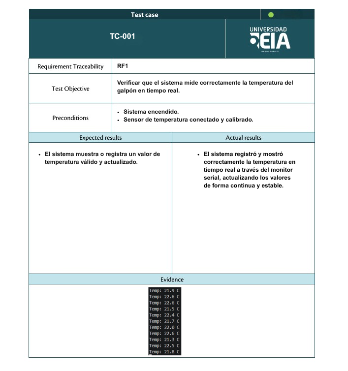

#### Test Case 2:
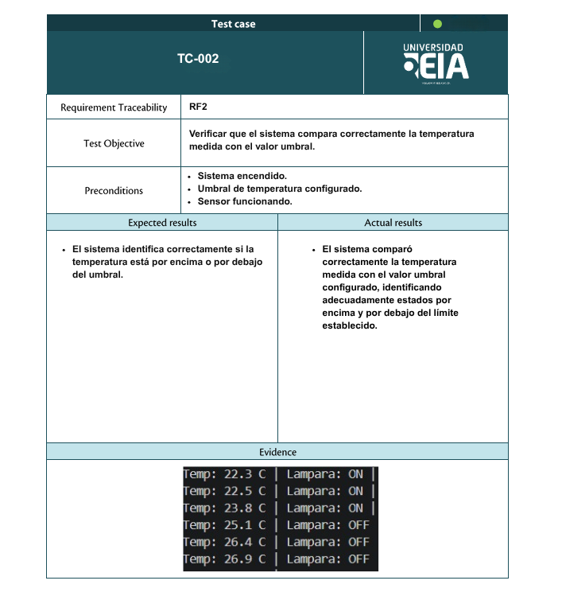

#### Test Case 3:
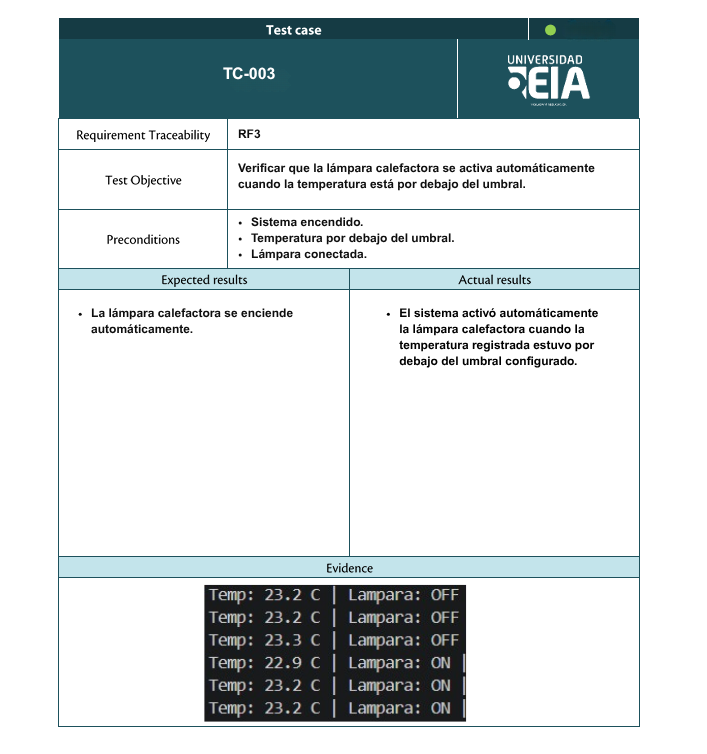

#### Test Case 4:
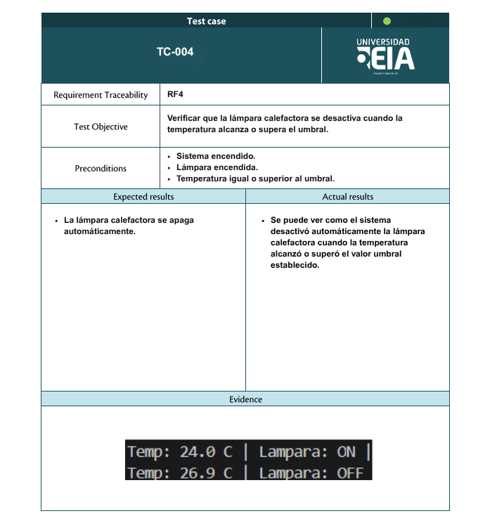

#### Test Case 5:
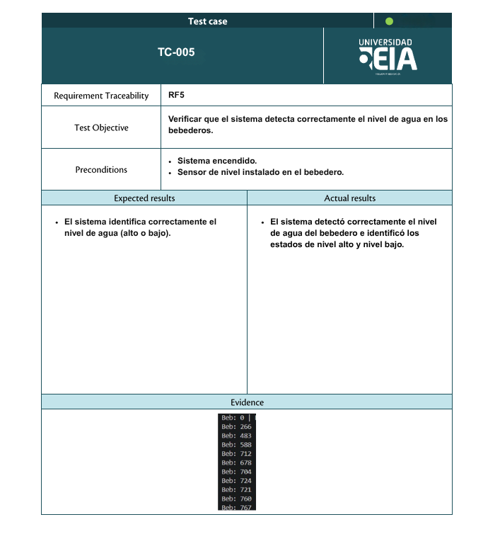

#### Test Case 6:
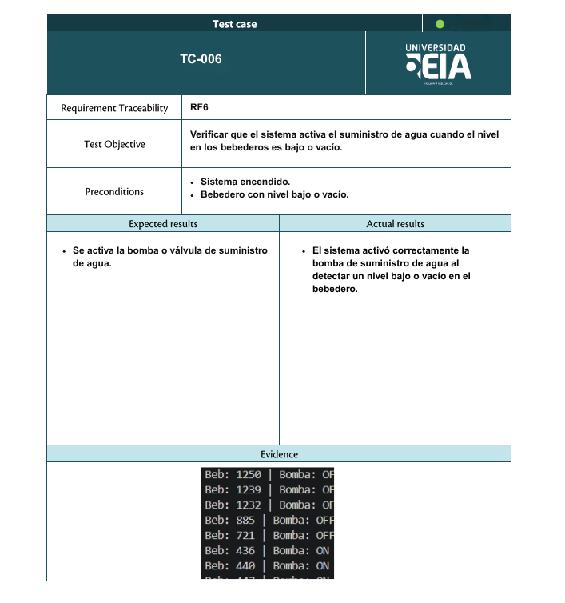

#### Test Case 7:
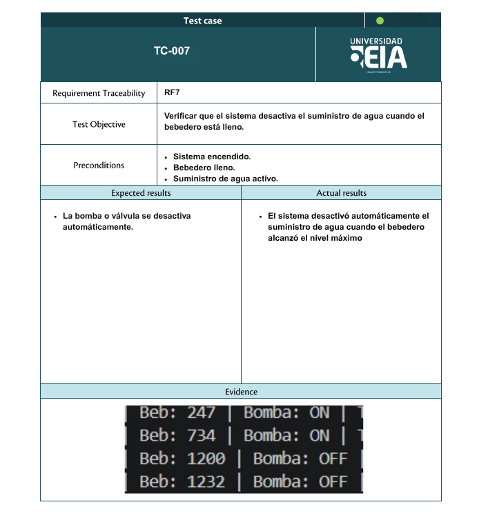

#### Test Case 8:
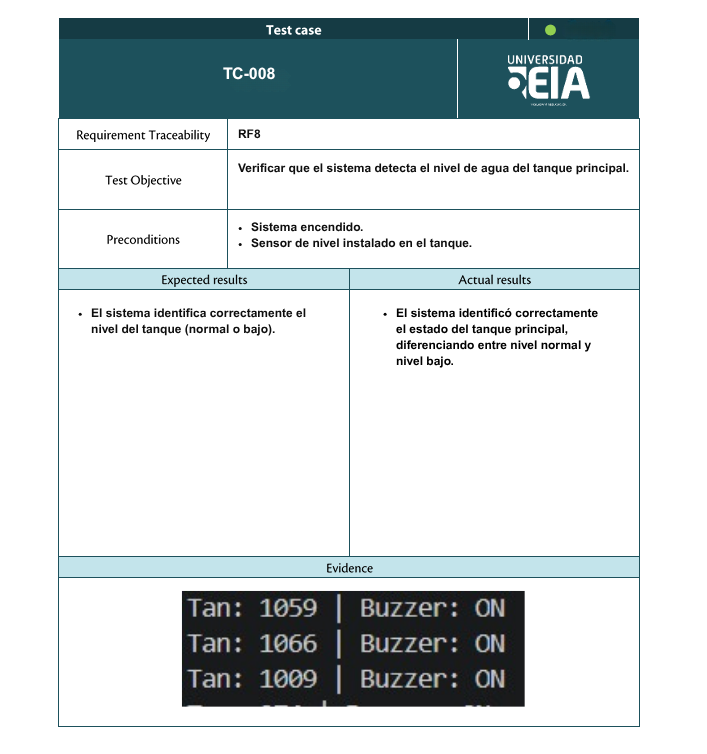

#### Test Case 9:
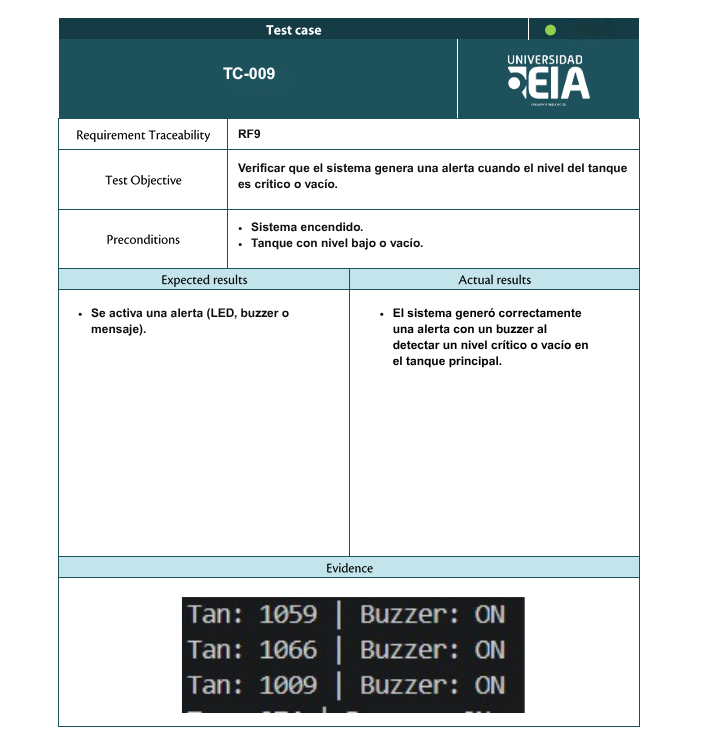

#### Test Case 10:


#### Test Case 11:

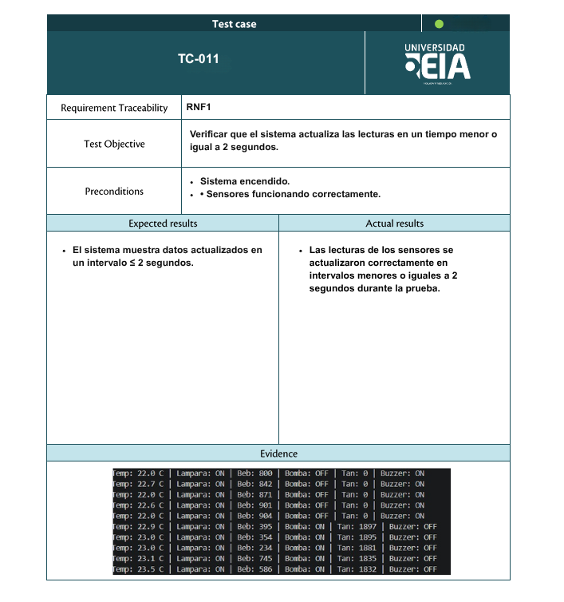

#### Test Case 12:

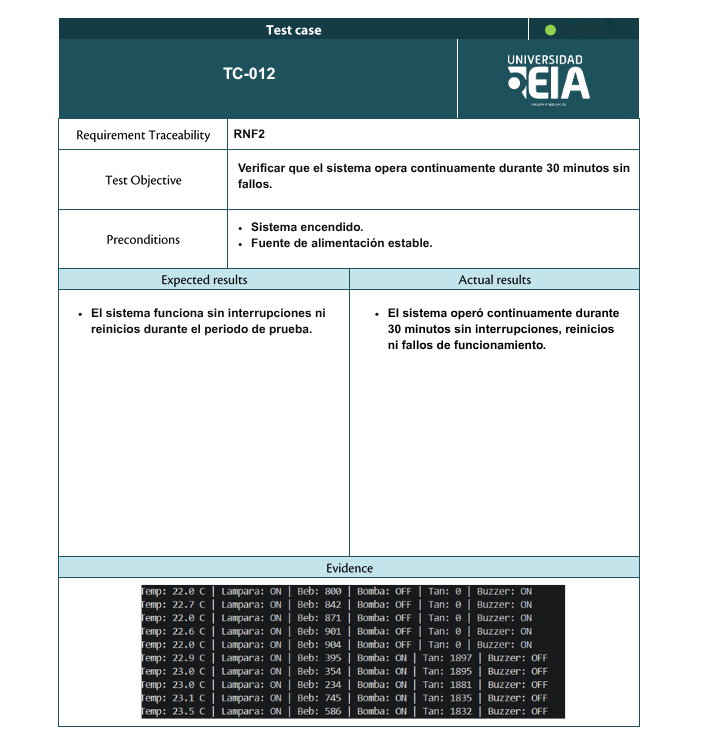

#### Test Case 13:

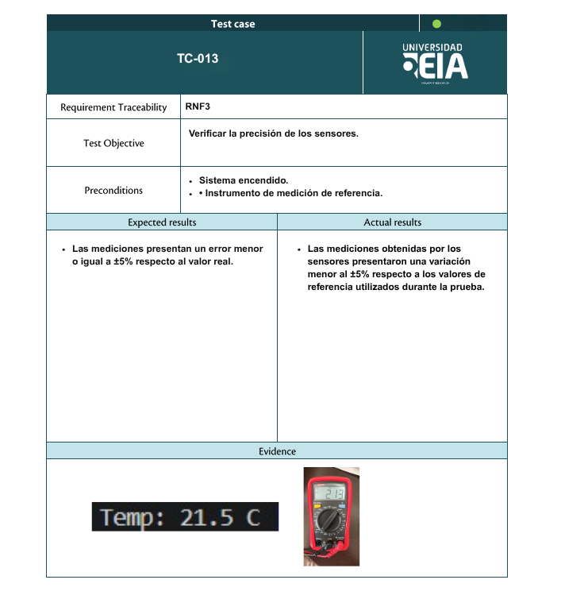

#### Test Case 14:

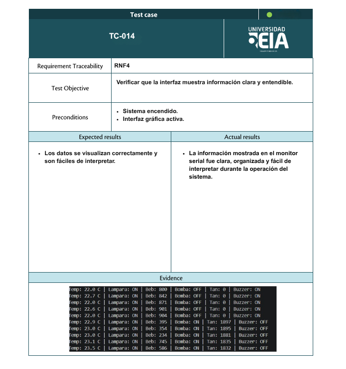

#### Test Case 15:

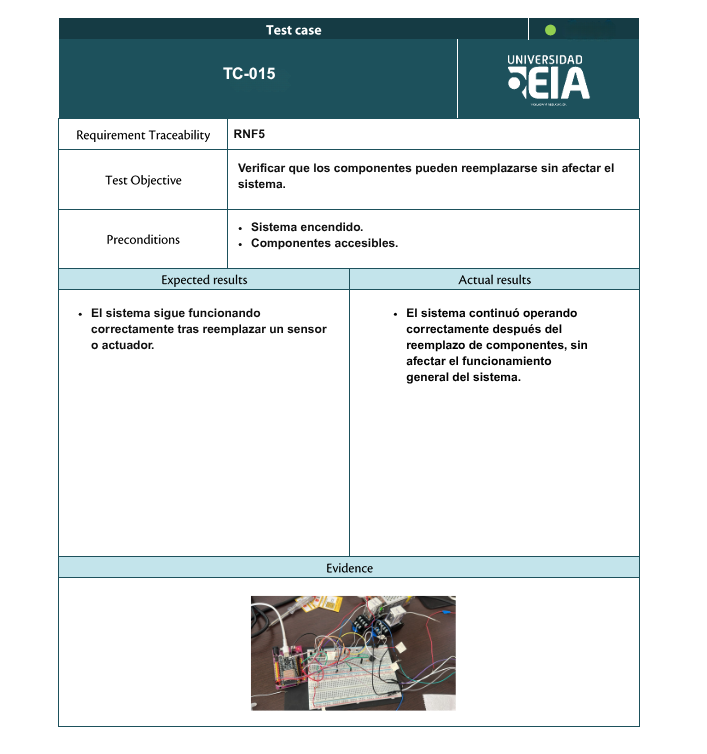

