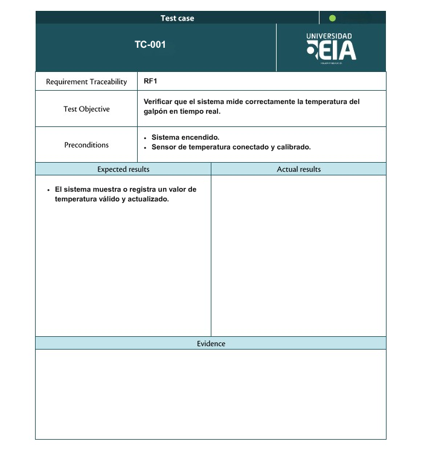
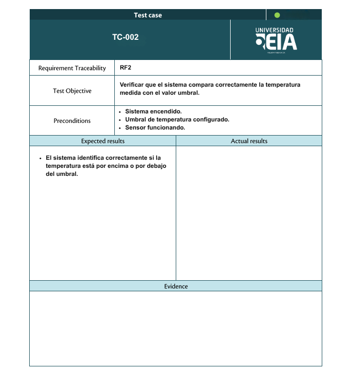
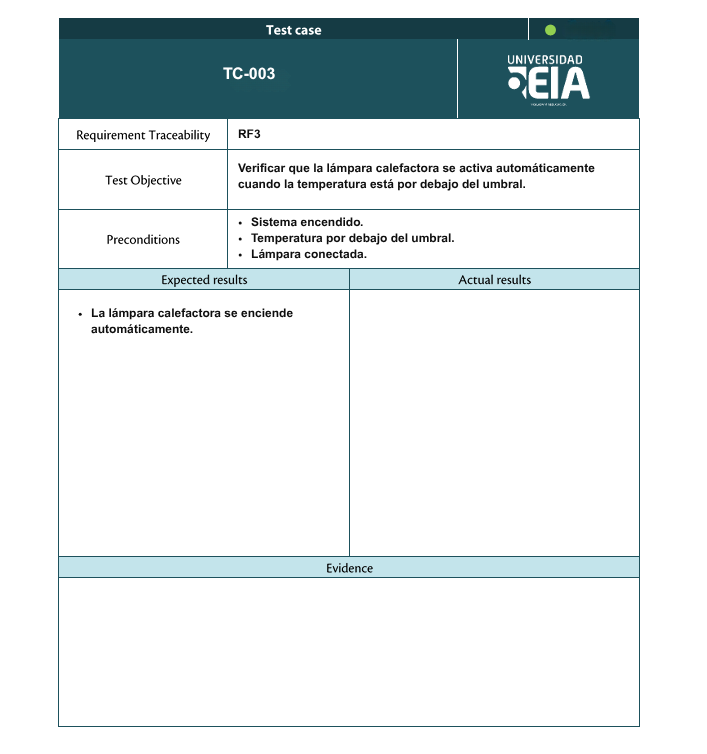
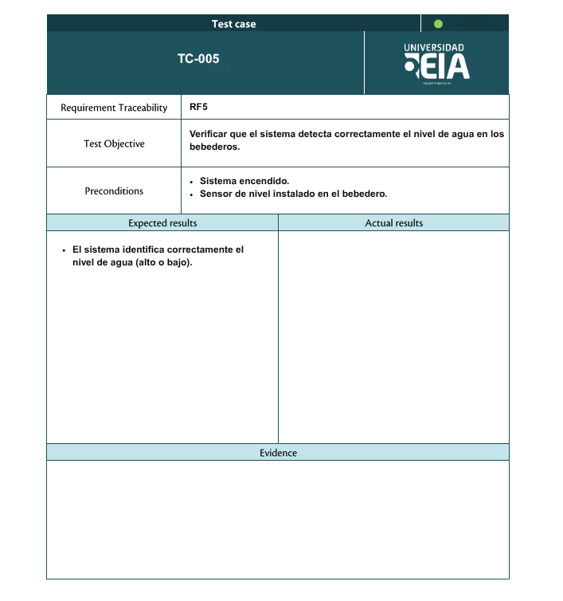
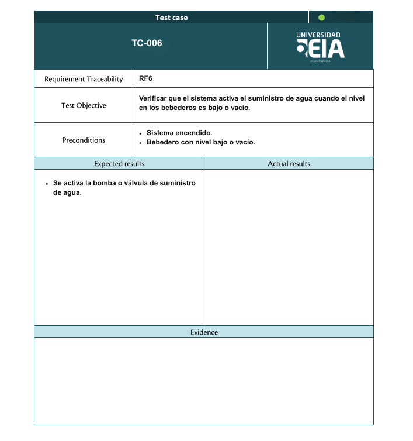
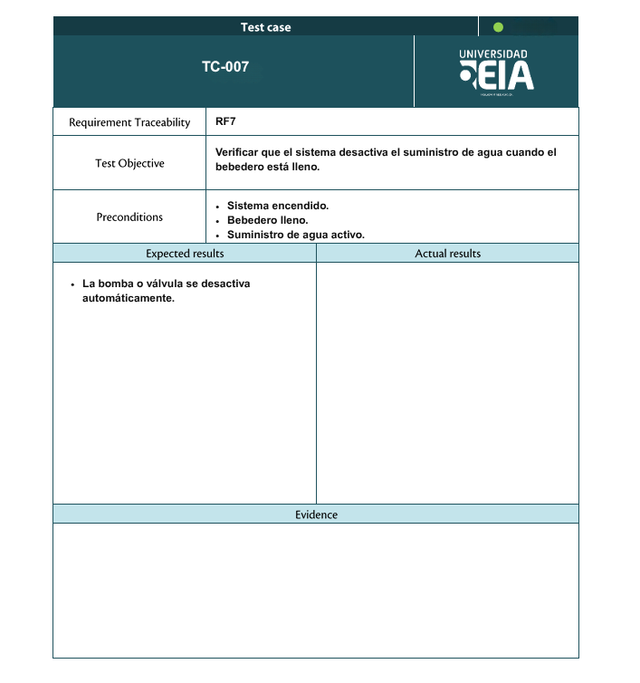
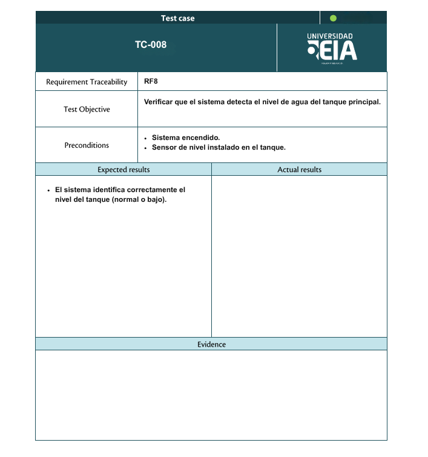
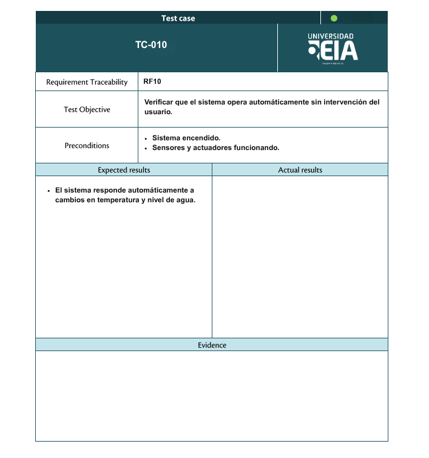

## Requisitos funcionales del sistema (RF):

- **RF1:** El sistema debe medir la temperatura del galpón en tiempo real mediante un sensor. 
- **RF2:** El sistema debe comparar la temperatura medida con un valor umbral configurado.
- **RF3:** El sistema debe activar automáticamente la lámpara calefactora cuando la temperatura esté por debajo del umbral.
- **RF4:** El sistema debe desactivar la lámpara calefactora cuando la temperatura alcance o supere el umbral establecido.
- **RF5:** El sistema debe detectar el nivel de agua en los bebederos mediante un sensor de nivel.
- **RF6:** El sistema debe activar el suministro de agua cuando el nivel en los bebederos sea bajo o vacío.
- **RF7:** El sistema debe desactivar el suministro de agua cuando los bebederos estén llenos.
- **RF8:** El sistema debe detectar el nivel de agua del tanque principal de almacenamiento.
- **RF9:** El sistema debe generar una alerta cuando el nivel del tanque principal sea crítico o vacío.
- **RF10:** El sistema debe operar de manera automática sin intervención del usuario durante su funcionamiento normal.

### Test Cases:

#### Test Case 1:

#### Test Case 2:

#### Test Case 3:

#### Test Case 4:

#### Test Case 5:

#### Test Case 6:

#### Test Case 7:

#### Test Case 8:

#### Test Case 9:

#### Test Case 10:

## Requsitos no funcionales del sistema (RNF):

- **RFN1:** 
*Rendimiento*:

El sistema debe procesar y actualizar las lecturas de los sensores en un tiempo máximo de 2 segundos.
- **RFN2:** *Disponibilidad*:

El sistema debe operar de forma continua durante al menos 30 min sin fallos.
- **RFN3:** *Confiabilidad*:

El sistema debe garantizar que las lecturas de los sensores tengan un margen de error máximo de ±5%.
- **RFN4:** *Usabilidad*:

El sistema debe presentar la información de temperatura y niveles de agua de forma clara y comprensible en la interfaz gráfica.
- **RFN5:** *Mantenibilidad*:

El sistema debe permitir la fácil sustitución de sensores y actuadores sin afectar el funcionamiento general.

### Test Cases - RNF:

#  Plan de Testing Detallado

## Objetivo
Validar el correcto funcionamiento del sistema embebido mediante pruebas prácticas sobre hardware y software, verificando cada requisito funcional y no funcional.

## Metodología de Pruebas
Cada requisito será validado mediante pruebas físicas utilizando instrumentos de medición, observación directa y monitoreo por comunicación serial.

## Pruebas por Requisito Funcional

1.	**RF1: Medición de temperatura**

*Procedimiento*:
- Encender el sistema
- Colocar el sensor de temperatura en el ambiente
- Medir la temperatura con un termómetro externo de referencia
- Comparar ambos valores

*Herramientas*:
- Termómetro externo
- Monitor serial (UART)

*Validación*:
- La diferencia entre valores debe ser mínima (±5%)

2.	**RF2: Comparación con umbral**

*Procedimiento*:
- Configurar un valor umbral en el sistema
- Simular cambios de temperatura (calor/frío)
- Observar el valor leído en el monitor serial

*Herramientas*:

- Secador/candela o hielo
- Monitor serial

*Validación*:

- El sistema identifica correctamente cuando supera o baja del umbral

3.	**RF3 y RF4: Control de lámpara**

*Procedimiento*:
- Simular temperatura baja
- Verificar encendido de la lámpara (LED o relé)
- Simular temperatura alta
- Verificar apagado

*Herramientas*:
- Multímetro
- Observación directa

*Validación*:
- Voltaje presente cuando debe encender
- Voltaje ausente cuando debe apagarse

4.	**RF5: Detección nivel de agua en bebederos**

*Procedimiento*:
- Vaciar parcialmente el bebedero
- Leer valor del sensor
- Llenar nuevamente

*Herramientas*:
- Sensor de nivel
- Monitor serial

*Validación*:
- El sistema detecta correctamente niveles bajo y alto

5.	**RF6 y RF7: Control de suministro de agua**

*Procedimiento*:
- Simular nivel bajo
- Verificar activación de bomba
- Simular nivel alto
- Verificar desactivación

*Herramientas*:
- Multímetro
- Observación de bomba

*Validación*:
- La bomba se activa y desactiva correctamente

6.	**RF8: Nivel del tanque principal**

*Procedimiento*:
- Reducir nivel del tanque
- Observar lectura del sistema

*Herramientas*:
- Sensor de nivel
- Monitor serial

*Validación*:
- El sistema reporta correctamente el nivel

7.	**RF9: Alerta nivel crítico**

*Procedimiento*:
- Llenar el tanque de agua 
- Reducir manualmente el nivel de agua hasta alcanzar el nivel crítico o mover el sensor
- Observar la respuesta del sistema

*Herramientas*:
- Tanque de agua 
- Sensor de nivel 
- Monitor serial (UART) 
- Observación directa

*Validación*:
- El sistema detecta el nivel crítico 
- Se activa la alerta (LED, buzzer o mensaje en monitor serial)

8.	**RF10: Operación automática**

*Procedimiento*:
- Encender sistema
- No intervenir manualmente
- Cambiar condiciones (temperatura y agua)

*Herramientas*:
- Observación directa

*Validación*:
- El sistema responde automáticamente sin intervención

### Pruebas por Requisitos No Funcionales

1.	**RNF1: Rendimiento**

*Procedimiento*:
- Observar el tiempo entre lecturas en el monitor serial
- Medir intervalo con timestamps

*Herramientas*:
- Código en ESP-IDF (esp_timer_get_time) para registrar timestamps evitando errores de medición humana
- Monitor serial

*Validación*:
- Tiempo ≤ 2 segundos

2.	**RNF2: Disponibilidad**

*Procedimiento*:
- Dejar el sistema encendido durante 30 min
- Monitorear funcionamiento

*Herramientas*:
- Fuente estable
- Observación periódica

*Validación*:
- Sin reinicios ni fallos

3.	**RNF3: Confiabilidad**

*Procedimiento*:
- Comparar lecturas con instrumentos reales
- Realizar múltiples mediciones

*Herramientas*:
- Termómetro
- Medidor de referencia

*Validación*:
- Error ≤ ±5%

12.	**RNF4: Usabilidad**

- El sistema debe operar dentro de rangos seguros de voltaje sin generar sobrecargas.

*Procedimiento*:
- Medir voltaje en los pines de salida (LED, bomba, etc.)
- Verificar valores durante operación

*Herramientas*:
- Multímetro

*Validación*:
- Voltajes dentro de rangos seguros (ej: 3.3V / 5V)

13.	**RNF5: Mantenibilidad**

*Procedimiento*:
- Desconectar un sensor
- Reemplazarlo por otro
- Encender sistema nuevamente

*Herramientas*:
- Componentes de repuesto

*Validación*:
- El sistema sigue funcionando correctamente

## Criterios de Aceptación
El sistema será considerado válido si:
- Todas las pruebas cumplen los resultados esperados
- No presenta fallos en condiciones normales
- Responde correctamente a eventos críticos

