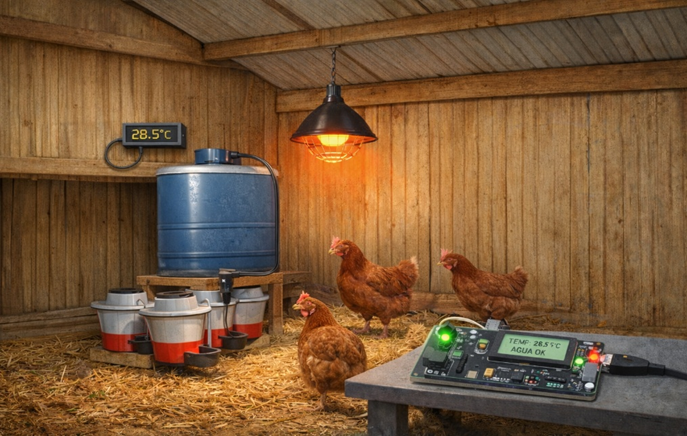

# Proyecto Sistemas Embebidos

## Integrantes

- Jacobo Velásquez Durango
- Orlando Velásquez Granda
- María José Rojas mosquera

## Sistema Embebido para Automatización de un Galpón Avícola
1. *Introducción*:
En la producción avícola es fundamental mantener condiciones adecuadas dentro de los galpones para garantizar el bienestar y la productividad de las gallinas. Variables como la temperatura y el suministro de agua deben ser controladas constantemente, ya que cambios en estas condiciones pueden afectar la salud de las aves y el funcionamiento del sistema de producción.
En muchos casos estos controles se realizan de forma manual, lo que puede generar retrasos en la detección de problemas como bajas temperaturas o falta de agua en los bebederos. Por esta razón, la automatización mediante sistemas embebidos representa una alternativa eficiente para monitorear y controlar estas variables de manera continua.
Este proyecto propone el desarrollo de un sistema embebido capaz de monitorear la temperatura del galpón y el nivel de agua disponible para las gallinas, permitiendo activar automáticamente una lámpara calefactora y controlar el suministro de agua cuando sea necesario.

2. *Descripción del problema*:
En los galpones avícolas es necesario garantizar condiciones adecuadas de temperatura y disponibilidad constante de agua. Sin embargo, cuando estos factores se controlan manualmente pueden presentarse fallas en la detección oportuna de problemas.
Por un lado, una temperatura inadecuada puede afectar el bienestar de las gallinas, especialmente en etapas tempranas de crecimiento. Por otro lado, si los bebederos se quedan sin agua o el tanque de almacenamiento se vacía, las aves pueden verse afectadas si el problema no se detecta rápidamente.
Ante esta situación, surge la necesidad de implementar un sistema que permita monitorear estas variables y automatizar algunas acciones para mantener condiciones adecuadas dentro del galpón.

3. *Alcance del proyecto*:
El proyecto consiste en el diseño de un sistema embebido que permita monitorear la temperatura del galpón y el nivel de agua en los bebederos y en el tanque de almacenamiento.
El sistema activará una lámpara calefactora cuando la temperatura sea inferior al valor establecido y controlará el suministro de agua cuando los bebederos se encuentren vacíos. Además, se generará una alerta cuando el tanque principal de agua se encuentre sin suministro.
El desarrollo se centrará en la implementación de un prototipo funcional que integre sensores, actuadores y la lógica de control necesaria para su operación.

4. *Objetivo general*:
Diseñar e implementar un sistema embebido que permita monitorear y controlar la temperatura y el suministro de agua en un galpón avícola mediante sensores y actuadores electrónicos.

5. *Objetivos específicos*:
- Medir la temperatura dentro del galpón mediante un sensor.
- Activar una lámpara calefactora cuando la temperatura esté por debajo del valor establecido.
- Detectar cuando los bebederos de las gallinas no tengan agua.
- Activar el suministro de agua cuando sea necesario.
- Detectar cuando el tanque de almacenamiento de agua se encuentre vacío.

6. *Asignación de roles*:
Technical Lead: Jacobo Velásquez Durango  
Firmware Engineer: Orlando Velásquez Granda
Hardware Integration Engineer: María José Rojas Mosquera 
Verification & Testing Engineer : María José Rojas Mosquera , Orlando Velásquez Granda y  Jacobo Velásquez Durango  

